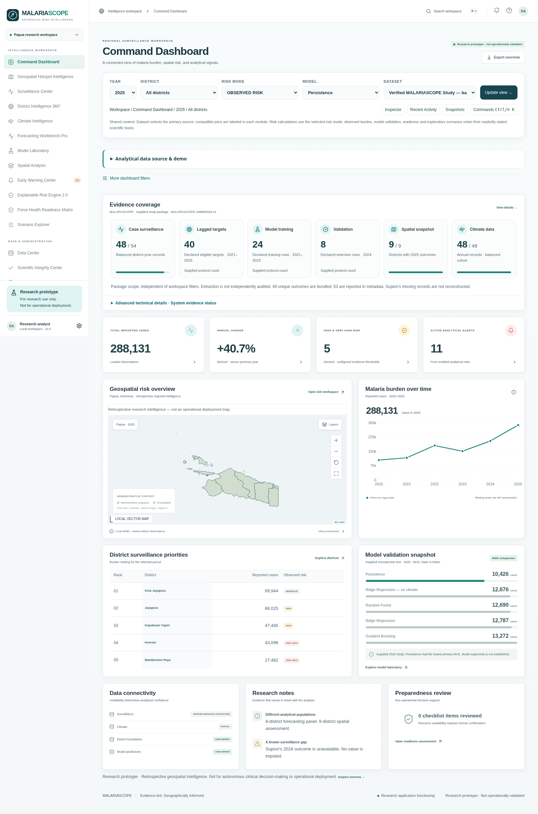
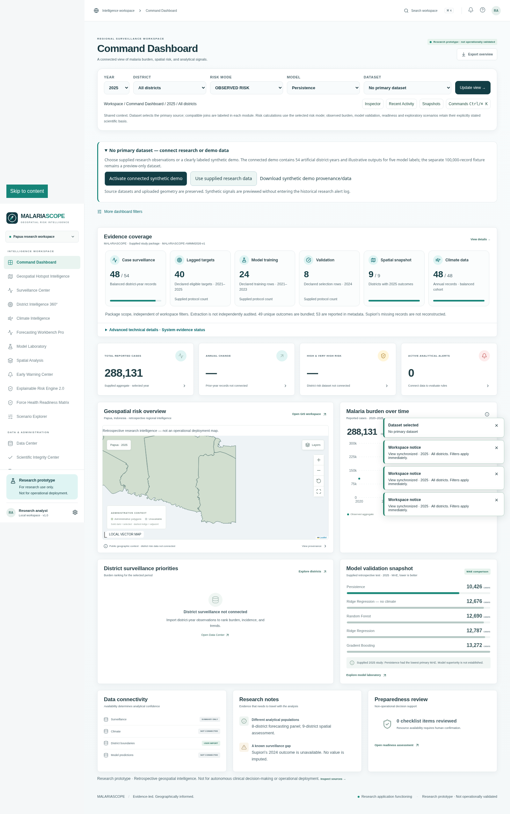

# Scientific dashboard redesign

The existing application now uses a restrained navy–teal presentation system, shared card and metric components, a locally served Inter variable font, and a scrollable grouped navigation with a compact research footer. All existing route destinations remain available. The dedicated `/mobile`, smartwatch, IoT, and desktop workstation interfaces remain intact.

The Command Dashboard leads with its title, synchronized global context, and data source controls. Evidence coverage uses readable cards; raw coverage metadata and system status live in a collapsed Advanced Technical Details section. The dashboard retains observed totals, year-over-year change, configured incidence risk counts, generated signals, local-vector GIS, annual series, district rankings, supplied model comparisons, connectivity, research limitations, and human-reviewed checklist summaries.

## Scientific boundaries

- No data files, risk formulas, prediction values, alert rules, spatial calculations, or scientific verification flags are changed.
- Evidence cards describe the supplied package, independent of workspace year/district/dataset filters. This scope is visible on the card. Balanced surveillance is 48 of 54 candidate district-years; only 49 unique observed outcomes are actually bundled, despite 53 reported in metadata.
- Training/selection/lagged-target counts are declared protocol metadata, labeled as such; they are not rendered as fabricated completeness fractions.
- Spatial snapshot coverage means observed district outcomes, not connected administrative boundaries. Actual boundary connectivity remains separately displayed.
- The model comparison is supplied 2025 MAE, lower is better. Bar scaling uses available values. The study's numerical ranking does not establish model superiority.
- The map retains its existing four risk categories and missing-data behavior. No illustrative fifth category or synthetic uncertainty band is added.
- Synthetic demo outputs remain labeled and separate from study coverage.
- Filters apply immediately. Update view requests chart/map resize and confirms synchronization; it does not introduce an alternate filter state or reload data.
- The reference image was not present in the supplied files. The redesign follows the written visual specification without claiming a pixel match.

## Design assets and verification

InterVariable.woff2 is distributed with its SIL Open Font License in `public/fonts/Inter-LICENSE.txt`, sourced from https://github.com/rsms/inter. Desktop typography does not depend on external Google Fonts requests.

`tests/scientific-dashboard-design.mjs` checks 1440×900, 1600×1000, 1920×1080, 2560×1440, tablet 768×1024, and narrow fallback layouts at 390×844 and 320×740. It captures screenshots under `/tmp/malariascope-design`, tests overflow/map width, real/empty/synthetic source states, global filters, technical-details disclosure, command palette, main-content axe accessibility, and preservation of `/mobile`. Existing browser regression suites cover the remaining scientific workflows.

Final local verification passed: 181 unit tests, typecheck, lint, and production build; 23/23 browser acceptance suites; zero detected main-content axe violations across 24 routes. The final semantic-table and dynamic-period refinements were additionally checked by dashboard/responsive/accessibility acceptance and the import/alerts/readiness smoke test. Failed evidence loading and successful retry are also covered. These checks do not establish scientific or operational validation.

## Review screenshots

The screenshots show the supplied retrospective study package and the honestly disconnected primary-dataset state. Transient notifications are omitted from the screenshot capture only.

